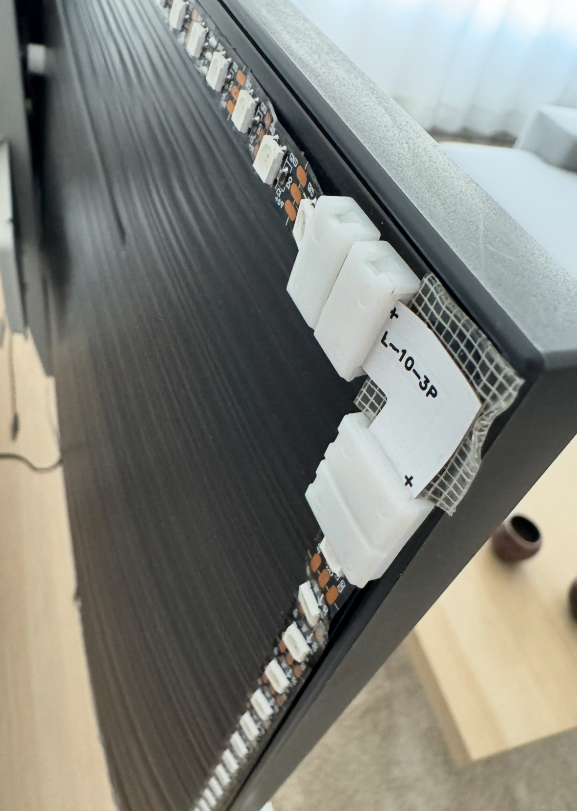
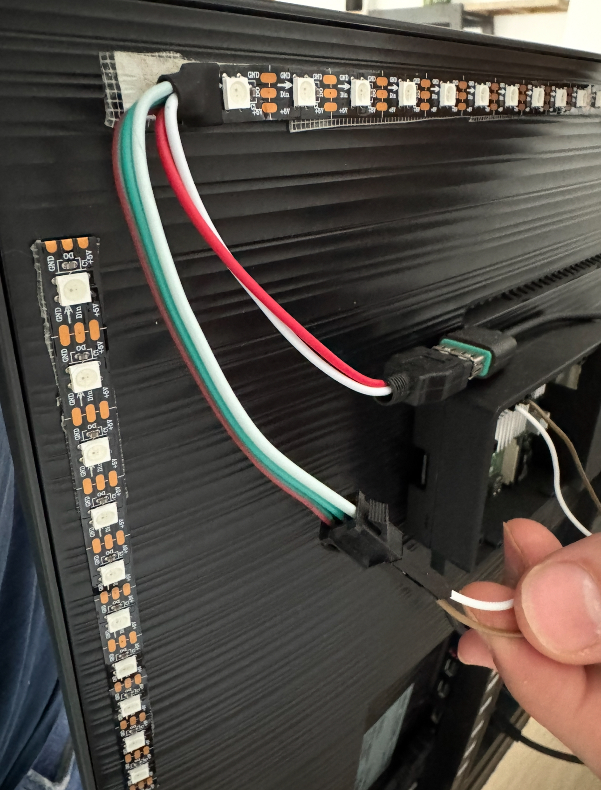
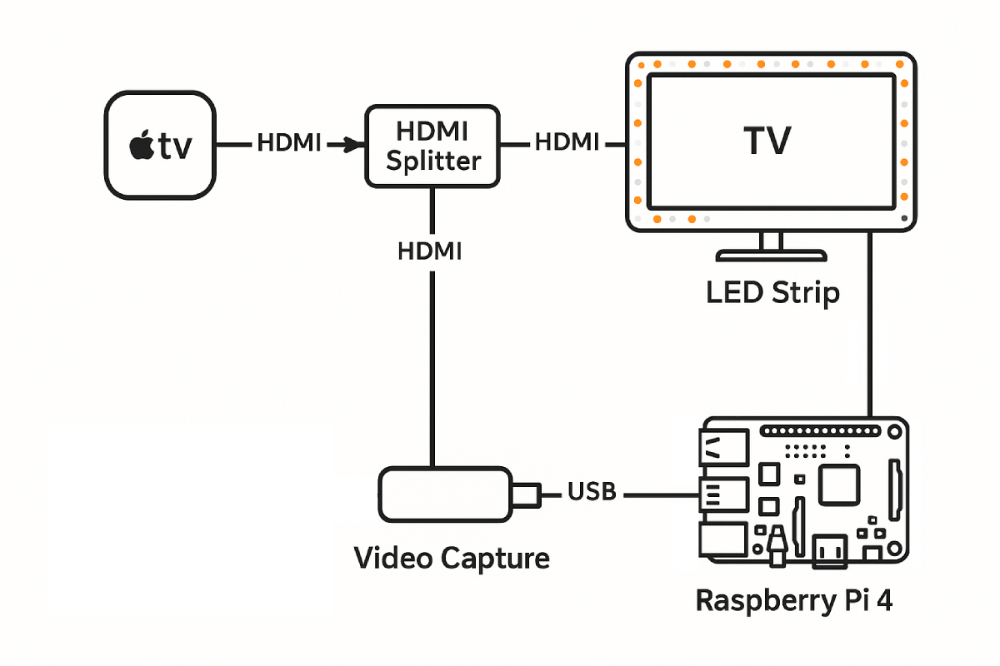

# OpenLight
Openlight is an open source version of the Ambilight system. It helps to create inmersion atmosphere with your TV using a LED strip to syncronize the content between the images in the TV and the LEDs colors displayed in real time. The frames of the TV are "extended" far away from the screen with light.

## How the system works
Ambilight systems can work using an external camera to capture the image from the TV like Groove or using a video capture to get the frames. Once the image has been captured, there is a post processing of the frames to extract the colors next to the TV frame and changing the color of the LEDs.

For OpenLight, we are using the second option, obtaining the images through a video capture.

## Limitations
TV are not supossed to allow the image to be output. You can plug a HDMI for image input like a console, Apple TV, multimedia device, PC ... But you can't get out the image from the TV using the HDMI. For this reason, video capture projects for ambilight only works for these external devices which allows to output the image. They have a perfect match color and black pixels made LED totally turned off. For systems like Groove with cameras, reflections and external lights may vary the resulting color of the LEDs.

## External hardware dependencies
In order to run Openight you need:
- Multimedia device: As commented before: Apple TV, laptop, PS, Switch, Xbox, ...
- HDMI splitter (1 In, 2 Out): This is a crucial part of the system and the quality will affect the image on your screen. A bad quality splitter is not recommended.
- Video capture: A cheap one is totally perfect (mine is just $10).
- Raspberry Pi 4 (RBP4): Where you must copy this repo and compile the files.
- LED strip: It is crucial for the LED strip to be able to control the data, this means you can change each individual led without affecting the rest. I used WS2812B led strip. The amount of LEDs per meter will affect the result since the more LEDs you use, more process it needs per frame. I bought https://www.amazon.es/dp/B0BTVB7WRY 300LEDs/5M.
- Corner connectors: with the same number of pins than the LED strip, in my case 3 pins. I used this one https://www.amazon.es/dp/B08VRGRYM9

### How the external hardware will be used
- Multimedia device (e.g Apple TV): Source of the image.
- HDMI splitter: It will be used to split the image from the multimedia device to two different destinations. The TV that will display the image (and the reason of the splitter quality) and the second destination, the video capture. 
- Video capture: The device is used to pass the video from the splitter into the RBP4. You don't need a good one because we will not use the full image to process the color of the LEDs and the image will be resized, in order to run the code faster.
- Raspberry Pi 4: The brain of the project, you'll need to compile and run the code inside the Pi. The led strip will be connected to this device.
- LED Strip: Installed in the back part of the TV it is connected directly to the RBP4 and into the plug using the USB included. You must remove the strip bluetooth controller if any in order to proceed with the installation. But keep the 4 cables for RBP and the other 2 with the USB. Keep in mind the start of the LED strip must be connected to the Raspberry Pi, do not cut the cable that provides power or access to the data. Please read the whole document before proceed with this process.
- Corner connectors: After cutting the LED strip, use the corner connectors to join each LED strip to join together placing it in the back part of the TV.


## LED connection to RaspBerry Pi 4
Using the RBP4 schema, in my case RBP4 model B,  plug gound cable to a Ground pin, I used PIN 6. And data to PIN 12 wich is GPIO 18. If you use GPIO 12 rather than 18, change GPIO_PIN in LedStrip.cpp file.


## Schema
Follow this schema in order to do the setup.


## Dependencies

Run your raspberry pi 4 using SSH or connect a mouse, keyboard and a monitor in order to access the console. (No LED strip is needed yet)
Install `raspi-gpio` and  is installed before running the project:

```bash
sudo apt update
sudo apt install raspi-gpio cmake g++ libopencv-dev
```

In order to install rpi_ws281x to check the CMakeLists.txt comment.

## Before you compile the code
Count the number of LEDs in each side of the screen and write the number of leads in main.cpp for N_LEDS_TOP, N_LEDS_BOTTOM, N_LEDS_LEFT and N_LEDS_RIGHT.
Left and right is from the user to the screen perspective, if you swipe it, the leds will appear in the opposite side of the screen.

I prepared the led strip anti-clockwise from top right corner of the screen (from the user perspective). -> Top right, top left, bottom left, bottom right and top right.
In case you already place the LED strip in a different orientation or order, you can modify FrameProcessing.cpp in order to iterate through each side in the correct way. From the beginning of the LED strip, sort the Top, Left, Bottom and Right blocks of code. Load a youtube video with 4 different colors at the corners. Once you plug it, you will see which sides needs to be reversed.

## Settings
Choose the brightness you are more confortable with in the LedStrip.cpp channel 0.

## Setup
Once you already plug in everything, compile the code and you will see a rainbow test spinning during a few seconds. This test also helps the multimedia device to has the output available and avoid missing the first frame when you run the code.

```bash
cmake ..
```

```bash
make
```

```bash
sudo ./openlight
```

## Next steps
Congrats! You already have an ambilight diy. Feel free to iterate with the code, improve it, add new features, ...
You can prepare the compiled file to be run each time the RBP4 turns on in order to have an automatic openlight system.

## FYI
I originally created this software in order to run with Python by myself but it has a lot of lag, so I decided to translate the code to C++ using an LLM and of course some hand changes and a ton of love. Feel free to share a picture or a video and mention me at X @antoniobertob to see the results.

PS: I testes successfully the openlight with movies and series in Disney+, Netflix, ... It works great. But I tested on the Steam Deck and the lag is not good. You should increase the FPS at the main.cpp but didn't try it (currently working at 24 fps).
